# Setup
This project uses Python version `3.8`.

From the project root directory, on a [virtual Python environment](https://virtualenvwrapper.readthedocs.io/en/latest/) (or not, if you're feeling brave), run:
```bash
pip3 install -r requirements.txt
```

Make sure that the source directory is added to your `$PYTHONPATH` environment variable.

# Consideraciones generales
Me dejé de hacer el hábil programador y (espero que para alegría tuya) aprendí un poco de `pandas`. Por lo que vi lo usan mucho con Jupyter, pero no tengo idea de cómo funciona eso. Si querés, para el próximo TP aprendo eso también. 

# Ejercicio 1
Todo el código está en `1`. Los archivos R imprimen los datasets en un `.csv` así los puedo levantar con `pandas`.

El script `preprocess.py` hace el preprocesamiento de los datos. Consiste en 3 pasos:
* log: se aplica el logaritmo natural a los datos.
* scale: se escalan los datos para que tengan media 0 y varianza 1.
* pca: se hace un PCA de los datos en su cantidad de dimensiones (o cantidad de puntos para `lampone`, son números pequeños). Las componentes resultantes llevan el nombre `pc_n` siendo `n` el número de componente (entre 1 y cantidad de componentes).

El orden de los pasos se puede alterar (pero log debe ocurrir antes que scale para tener números positivos).

El script `clustering.py` hace el clustering sobre el resultado del preprocesamiento y calcula la Purity Score (a mi entender el equivalente de `matchClasses` de R) del resultado, es decir la cantidad de aciertos usando el matching óptimo entre clusters y clases (para cada target feature), expresado como un número entre 0 y 1.

## `crabs`
Parámetros de `preprocess.py`:

```python
file_stem = "crabs"
feature_cols = ["FL", "RW", "CL", "CW", "BD"]
klass_cols = ["sex", "sp"]
```

Parámetros de `clustering.py` para K-Means:

```python
klass_cols = ["sex", "sp"]
method = KMeans
method_name = "k_means"
n_clusters = 2
```

Parámetros de `clustering.py` para Agglomerative:

```python
klass_cols = ["sex", "sp"]
method = AgglomerativeClustering
method_name = "agglomerative"
n_clusters = 2
```
### crabs log-scale-pca

Preprocesamiento:
```python
# Processed file stem.
file_stem = f"{file_stem}_log_scale_pca"

print(f"Log-Scale-PCA usando el dataset {file_stem}.")

# Apply log to the features (because the statement recommends it).
# Leave zeros intact.
X = np.ma.log(X.to_numpy()).filled(0)

# Normalize features.
X = StandardScaler().fit_transform(X)

# Apply PCA.
X = PCA(n_components=len(feature_cols)).fit_transform(X)
```

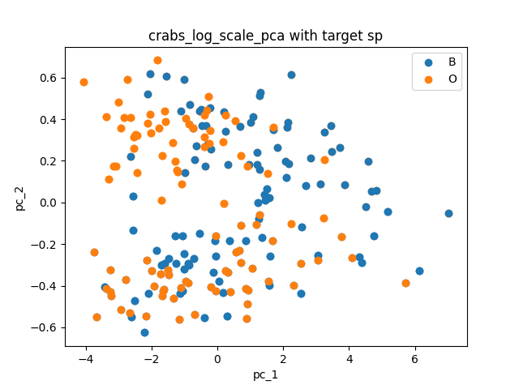

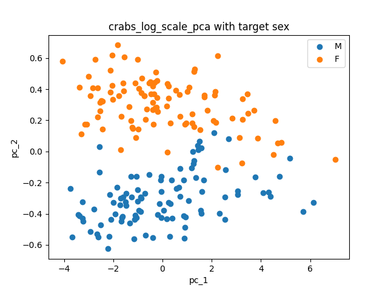

Vemos que `pc_1` no separa mucho, mientras que `pc_2` separa razonablemente por sexo. De todas formas ambos clusterings no encuentran las clases:

```
k_means usando el dataset crabs_log_scale_pca.
sex score: 0.515
sp score: 0.605
```

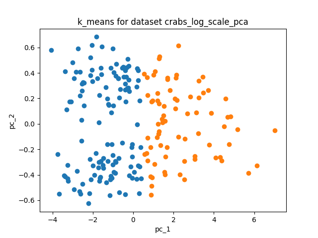

```
agglomerative usando el dataset crabs_log_scale_pca.
sex score: 0.555
sp score: 0.615
```

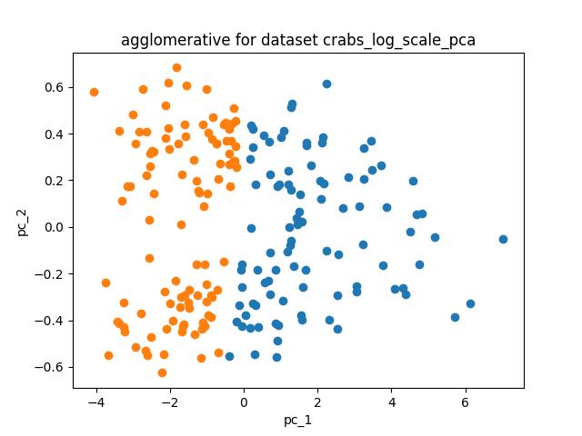

### crabs log-pca-scale

Preprocesamiento:
```python
# Processed file stem.
file_stem = f"{file_stem}_log_pca_scale"

print(f"Log-PCA-Scale usando el dataset {file_stem}.")

# Apply log to the features (because the statement recommends it).
# Leave zeros intact.
X = np.ma.log(X.to_numpy()).filled(0)

# Apply PCA.
X = PCA(n_components=len(feature_cols)).fit_transform(X)

# Normalize features.
X = StandardScaler().fit_transform(X)
```

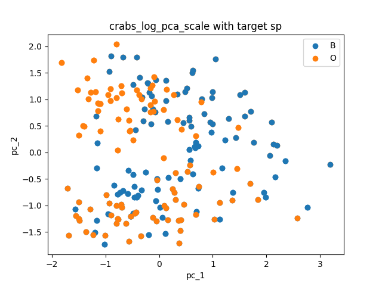

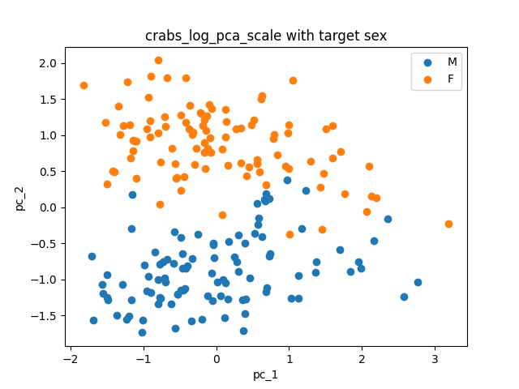

A ojo no noto diferencia con el caso anterior, pero...

```
k_means usando el dataset crabs_log_pca_scale.
sex score: 0.5
sp score: 1.0
```

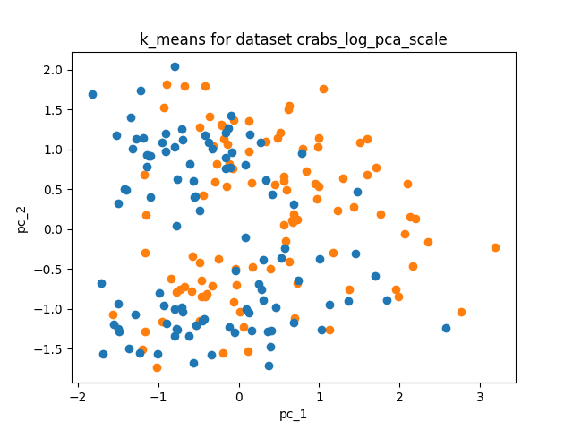

```
agglomerative usando el dataset crabs_log_pca_scale.
sex score: 0.515
sp score: 0.655
```

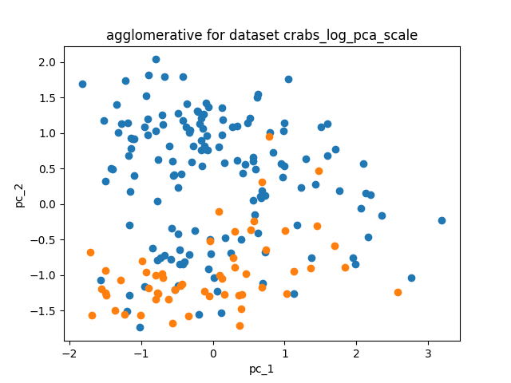

K-Means logra separa perfectamente por especie! Leyendo un poco [sobre el dataset crabs](http://rstudio-pubs-static.s3.amazonaws.com/188372_5022e757831144ebbd330657183358aa.html) parece que `pc_3` juega un papel importante. Graficando con `pc_1` y `pc_3` se ven claramente los dos clusters.

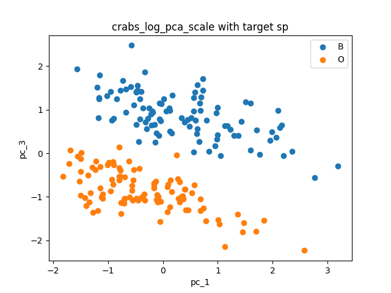

## lampone


Parámetros de `preprocess.py`:

```python
file_stem = "lampone"
feature_cols = [col for col in data_frame if col.startswith('m')]
klass_cols = ["anno", "N_tipo"]
```

Parámetros de `clustering.py` para K-Means:

```python
klass_cols = ["anno", "N_tipo"]
method = KMeans
method_name = "k_means"
n_clusters = 2
```

Parámetros de `clustering.py` para Agglomerative:

```python
klass_cols = ["anno", "N_tipo"]
method = AgglomerativeClustering
method_name = "agglomerative"
n_clusters = 2
```

### lampone log-scale-pca
Preprocesamiento igual que en [crabs log-scale-pca](#crabs-log-scale-pca).


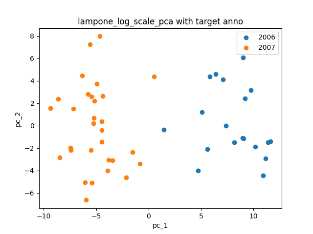

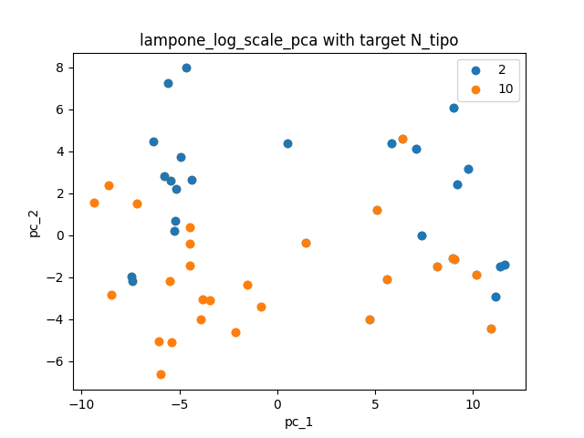

Veo que `pc_1` separa muy bien por año.

```
k_means usando el dataset lampone_log_scale_pca.
anno score: 0.9795918367346939
N_tipo score: 0.5510204081632653
```

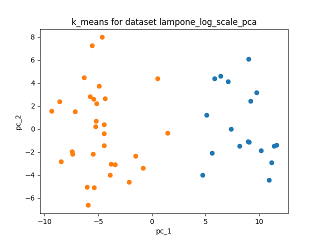

```
agglomerative usando el dataset lampone_log_scale_pca.
anno score: 0.9795918367346939
N_tipo score: 0.5510204081632653
```

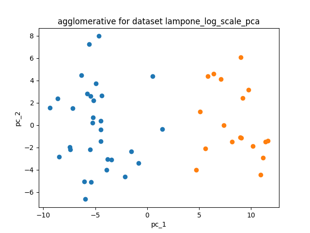

Ambos métodos dan el mismo clustering (me llama la atención porque es el mismo código que para crabs da clusterings distintos, es por mayor dimensionalidad?). Clasifica bien por año (excepto un punto) y mal por especie, lo que se corresponde con lo visto en las dos dimensiones del PCA.


### lampone log-pca-scale
Preprocesamiento igual que en [crabs log-pca-scale](#crabs-log-pca-scale).


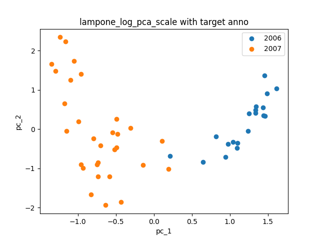

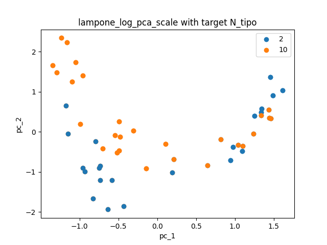

Nuevamente, `pc_1` separa por año (aunque peor que antes).

```
k_means usando el dataset lampone_log_pca_scale.
anno score: 0.6122448979591837
N_tipo score: 0.5510204081632653
```

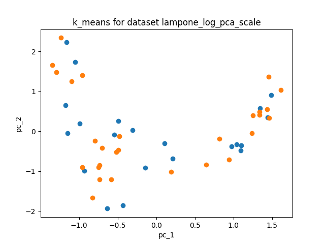

```
agglomerative usando el dataset lampone_log_pca_scale.
anno score: 0.6122448979591837
N_tipo score: 0.5510204081632653
```

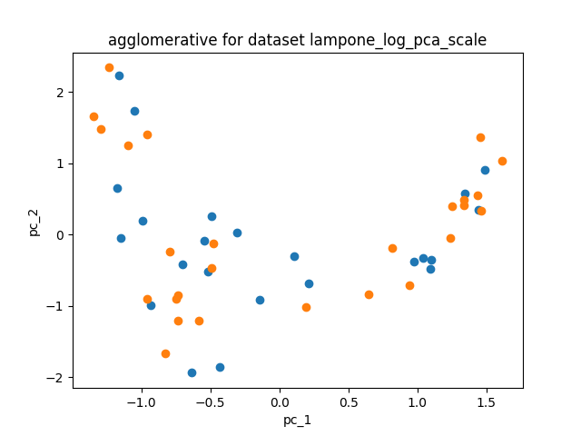

A pesar de tener el mismo score (!) los clusterings son distintos esta vez. No encuentran ninguna clasificación. Asumo que en las componentes que no son `pc_1` los puntos están más "mezclados" por año que en log-scale-pca.

# Ejercicio 2
El código se encuentra en la carpeta `2`.

## Consideraciones
Por el código de ejemplo en el enunciado asumo que está bien usar K-Means como método de clustering.

Para Gap Statistic usé la suma de las distancias al cuadrado [`inertia` de scikit](https://scikit-learn.org/stable/modules/generated/sklearn.cluster.KMeans.html?highlight=inertia). Si hace falta que calcule las distancias de otra forma, avisame.

En Stability usé [`fowlkes_mallows_score` de scikit](https://scikit-learn.org/stable/modules/generated/sklearn.metrics.fowlkes_mallows_score.html#sklearn.metrics.fowlkes_mallows_score), porque era una de las normalizaciones de las slides. Si querés que use otra (o que programe en python la que pasaste en R), avisame.

# Ejercicio 3
Los datasets y los gráficos se encuentran en la carpeta `3`.
Preprocesé los datos primero con una transformación logarítmica, luego escalado y luego PCA (como anteriormente en [crabs log-scale-pca](#crabs-log-scale-pca)).

Parámetros de Gap Statistic:
```python
method = KMeans
method_name = "k_means"
max_clusters = 10
uniform_count = 20
```

Parámetros de Stability:
```python
method = KMeans
method_name = "k_means"
max_clusters = 10
iterations = 20
```

## 4 gaussianas
El script `print_gaussianas.R` imprime el dataset en un `.csv`. Le puse nombres a las columnas a mano para no renegar.
No preprocesé este dataset porque es algo artificial que ya tiene clusters definidos (y lo intenté para ver que daba, no es algo agradable a la vista).

### Gap Statistic
Parámetros:
```python
file_stem = "gaussianas"
feature_prefix = "coord_"
```

```
Gap statistic con k_means usando el dataset gaussianas.
cluster size: 4
```

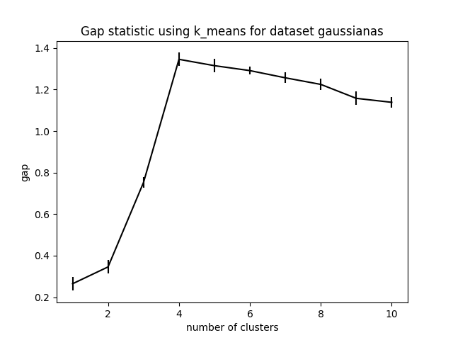

El dataset es artificial y presenta particularmente la estructura que busca el método de clustering. No me sorprende que la Gap Statistic funcione tan bien (aunque me asusta muy levemente el espacio entre 1 y 2 clusters).

### Stability
Parámetros:
```python
file_stem = "gaussianas"
feature_prefix = "coord_"
```

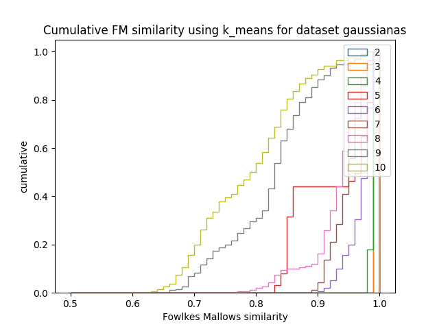

No sé por qué dibuja las líneas verticales en 1.0, pero no lo pude sacar fácilmente. Vemos que 2, 3 y 4 son estables. Usamos la regla de tomar la mayor y nos da 4 clusters, genial.

## iris
El script `print_iris.py` imprime el dataset en un `.csv`.

### Gap Statistic

Parámetros:
```python
file_stem = "iris_log_scale_pca"
feature_prefix = "pc_"
```

```
Gap statistic con k_means usando el dataset iris_log_scale_pca.
cluster size: 2
```

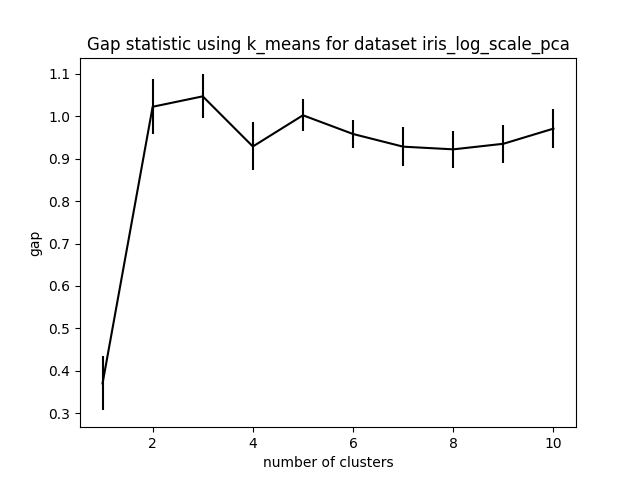

No encuentra los 3 clusters, pero si nos fijamos en qué pinta tiene el dataset procesado...

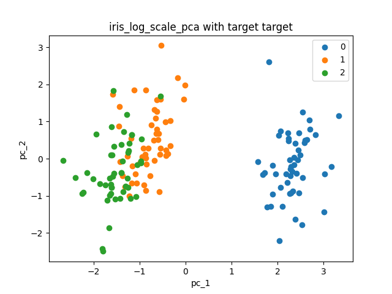

...es claro que hay dos grupos de puntos "compactos". Es decir, K-Means encuentra lo que busca y Gap Statistic correctamente le dice cuándo parar. Le echo la culpa al método de clustering o al procesamiento de los datos.

### Stability
Parámetros:
```python
file_stem = "iris_log_scale_pca"
feature_prefix = "pc_"
```

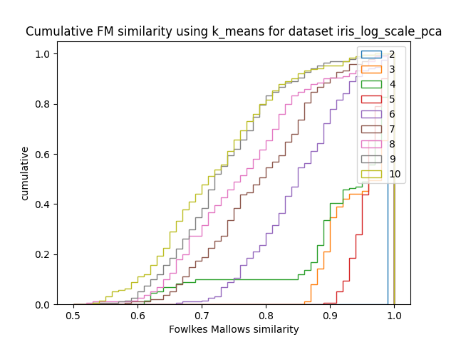

De nuevo, "funciona" en cuanto a que nos indica parar una vez encontramos los dos grupos de puntos "compactos" que vimos en el gráfico del dataset. Tiene sentido de que a partir de 3 clusters no sea estable.


## lampone


### Gap Statistic

A este le tengo mucha fe porque se portó bien en el ejercicio 1 con K-Means.

Parámetros:
```python
file_stem = "lampone_log_scale_pca"
feature_prefix = "pc_"
```

```
Gap statistic con k_means usando el dataset lampone_log_scale_pca.
cluster size: 2
```

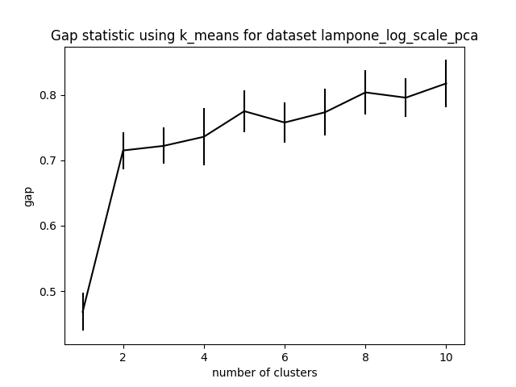

Anduvo! Qué bueno. De nuevo, Gap Statistic encuentra una buena cantidad de clusters para el método de clustering aplicado. Como en este caso K-Means funciona bien, Gap Statistic le dice correctamente cuándo parar.

### Stability
Parámetros:
```python
file_stem = "lampone_log_scale_pca"
feature_prefix = "pc_"
```

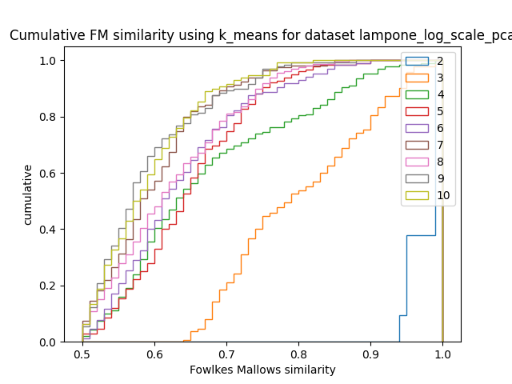

Lo mismo que dije para Gap Statistic, como K-Means anda bien se ve claramente que 2 es el único número de clusters estable.

# Ejercicio 4

Los gráficos y datasets están en la carpeta `4`. Usé el [dataset `wine` de scikit](https://scikit-learn.org/stable/modules/generated/sklearn.datasets.load_wine.html#sklearn.datasets.load_wine) porque está descripto como "clásico y muy fácil" y está listo para usar. `print_wine.py` genera el `.csv`.


## Preprocesamiento
De nuevo, preprocesé los datos como en [crabs log-scale-pca](#crabs-log-scale-pca).

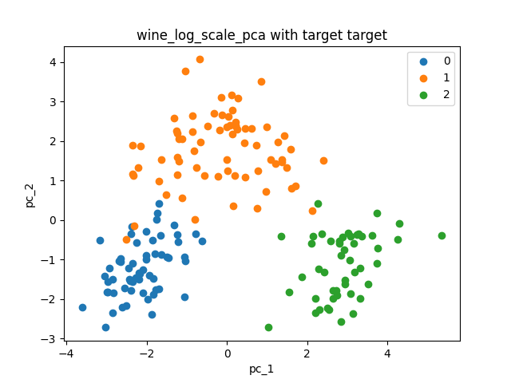

Hermoso, hay claramente 3 clusters "compactos". Como estoy haciendo trampa, puedo ver que se corresponden con la target feature. Aún si no fuera el caso, me daría la intuición de que hay 3 grupos de "algo" (y de que trabajar sobre estos datos probablemente tenga sentido) y, como tienen pinta de gaussianas, de que usar K-Means es buena idea.

## Gap Statistic
Vamos a comprobar si realmente K-Means encuentra 3 clusters, como uno creería a primera vista.

Parámetros de `gap_statistic.py`:
```python
file_stem = "wine_log_scale_pca"
feature_prefix = "pc_"
method = KMeans
method_name = "k_means"
max_clusters = 10
uniform_count = 20
```

```
Gap statistic con k_means usando el dataset wine_log_scale_pca.
cluster size: 3
```

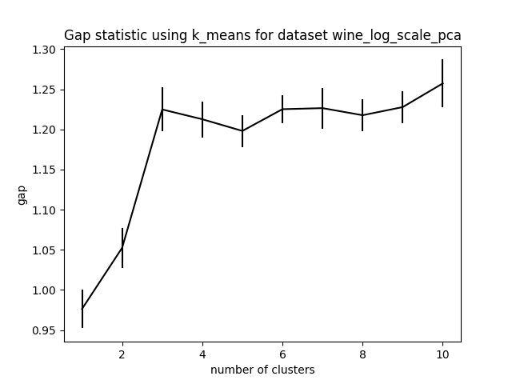

Da claramente 3, qué bien!

## Clustering

Vamos a ver cuán bien le va a K-Means con 3 clusters (el resultado de la Gap Statistic).

Parámetros de `clustering.py`:

```python
file_stem = "wine_log_scale_pca"
klass_cols = ["target"]
method = KMeans
method_name = "k_means"
n_clusters = 3
```

```
k_means usando el dataset wine_log_scale_pca.
target score: 0.949438202247191
```

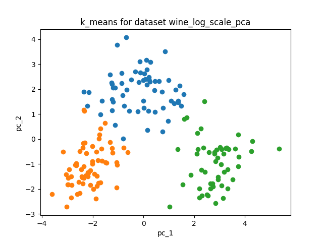

K-Means encuentra los clusters que uno "visualmente" reconoce al ver el resultado del PCA. Como mayoritariamente se corresponden con las clases, el score es muy alto.