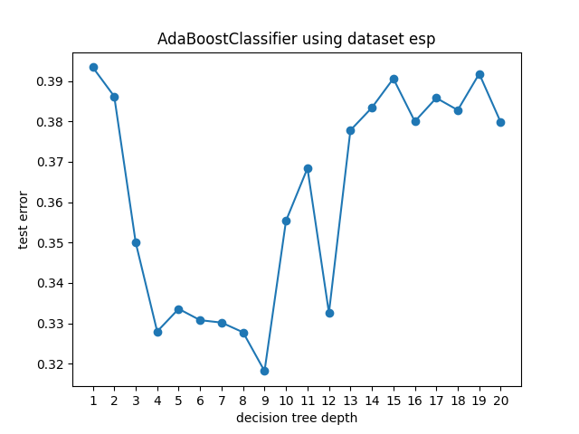
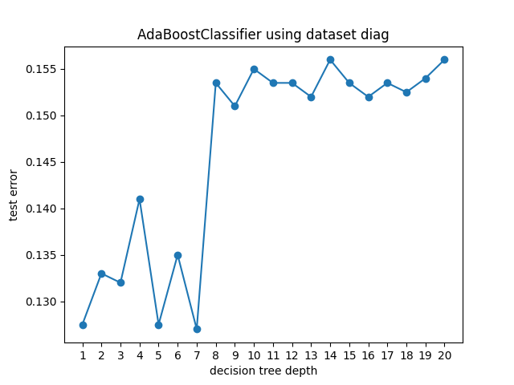
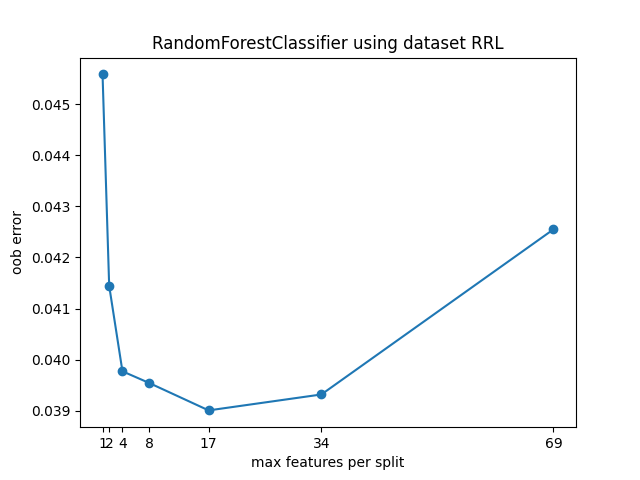

# Setup
This project uses Python version `3.8`.

From the project root directory, on a [virtual Python environment](https://virtualenvwrapper.readthedocs.io/en/latest/) (or not, if you're feeling brave), run:
```bash
pip3 install -r requirements.txt
```

Make sure that the source directory is added to your `$PYTHONPATH` environment variable.

# Ejercicio 1
Todos los archivos están en `1`. El archivo `print_datasets.R` imprime cada dataset en un `.csv`.

Para cada profundidad de árbol especificada, el script `boosting_depth.py` entrena un [`AdaBoostClassifier` de scikit](https://scikit-learn.org/stable/modules/generated/sklearn.ensemble.AdaBoostClassifier.html?highlight=adaboost#sklearn.ensemble.AdaBoostClassifier) con la cantidad de árboles de decisión especificada, usando el dataset de train. Luego evalúa el score de clasificación sobre el dataset de test y grafica el error de clasificación para cada profundidad.

## espirales anidadas
Parámetros de `boosting_depth.py`:

```python
file_stem = "esp"
feature_cols = ["x", "y"]
target_col = "class"
min_depth = 1
max_depth = 20
n_estimators = 200
```



En general anda bastante mal, pero graficando los datasets me resulta esperable el score obtenido. Se ve claramente el fenómeno explicado en clase, en el que primero hay demasiado bias, luego demasiada varianza. Observo el hecho de que "a boosting le gusta tener un clasificador rígido".

## diagonal
Parámetros de `boosting_depth.py`:

```python
file_stem = "diag"
feature_cols = ["V1", "V2"]
target_col = "class"
min_depth = 1
max_depth = 20
n_estimators = 200
```



Es interesante cómo al ser una distribución espacial más "simple" (en cuanto a que lograr un corte diagonal es mucho más sencillo haciendo una "escalera" con cortes horizontales y verticales que seguir la forma de espiral del dataset anterior), bastan árboles de profundidad 1. Es decir, nunca hay "demasiado bias" (luego sí hay "demasiada varianza"). Los resultados son mucho mejores en general.

# Ejercicio 2
Todos los archivos están en `2`. Hace bastante que no hacía un ejercicio que tenía que dejar corriendo un rato largo. `rf_features.py` es el script que hace todo lo pedido en el enunciado. Usa [`RandomForestClassifier` de scikit](https://scikit-learn.org/stable/modules/generated/sklearn.ensemble.RandomForestClassifier.html?highlight=random%20forest#sklearn.ensemble.RandomForestClassifier).

Parámetros de `rf_features.py`:
```python
file_stem = "RRL"
min_depth = 1
n_estimators = 1000
n_iterations = 5
```



Random Forest es un método que funciona al revés que Boosting: arranca desde "tengo demasiada varianza" y busca reducirla haciendo un promedio de varios árboles. Es claro entonces que tomar un árbol demasiado rígido no da buenos resultados. A medida que aumenta `max_features` el método comienza a mejorar, llega a un óptimo y empeora. Esto se debe a que con `max_features = 69` es equivalente a hacer bagging (que suponíamos peor). La regla de oro de tomar la raíz cuadrada es buena (aunque en este caso no es óptimo).

# Ejercicio 3


Todos los archivos se encuentran en la carpeta `3`.
Como no tengo acceso a las librerías de R, usé respectivamente:
* [`RandomForestClassifier` de scikit](https://scikit-learn.org/stable/modules/generated/sklearn.ensemble.RandomForestClassifier.html?highlight=random%20forest#sklearn.ensemble.RandomForestClassifier).
* [`AdaBoostClassifier` de scikit](https://scikit-learn.org/stable/modules/generated/sklearn.ensemble.AdaBoostClassifier.html?highlight=adaboost#sklearn.ensemble.AdaBoostClassifier).
* [`SVC` de scikit](https://scikit-learn.org/stable/modules/generated/sklearn.svm.SVC.html#sklearn.svm.SVC), con `kernel=rbf`.
* [`SVC` de scikit](https://scikit-learn.org/stable/modules/generated/sklearn.svm.SVC.html#sklearn.svm.SVC), con `kernel=poly`.

Para estimar el error de test hice 5-fold cross validation de la siguiente forma:
1. Separo 1/5 de los datos como conjunto de validación, el resto como training usando [`StratifiedKFold` de scikit](https://scikit-learn.org/stable/modules/generated/sklearn.model_selection.StratifiedKFold.html#sklearn.model_selection.StratifiedKFold) para mantener las proporciones de las clases en los folds.
2. Sobre los datos de training vuelvo a hacer 5-fold cross validation para elegir parámetros óptimos utilizando [`GridSearchCV` de scikit](https://scikit-learn.org/stable/modules/generated/sklearn.model_selection.GridSearchCV.html#sklearn.model_selection.GridSearchCV).
3. Entreno el modelo usando todos los datos de training (usando los parámetros óptimos) y obtengo su error de clasificación sobre el conjunto de validación.
4. Repito los pasos 1 a 3 para cada fold y promedio los errores de clasificación. El promedio es mi error estimado de test.
Todo esto lo hace `err_estimator.py`.

Si Breiman supiera lo que me quejo de los tiempos de ejecución con la tecnología actual, me ejecutaría él.

## Random Forest
En tus palabras "el número de árboles no es importante, mientras sean muchos", por lo que el único parámetro a ajustar es la cantidad de features que se evalúan por nodo. Usé 1000 árboles y busqué el óptimo a ojímetro cerca de la raíz cuadrada de la cantidad de features totales (la raíz es más o menos 12).

Parámetros de `err_estimator.py`:
```python
file_stem = "lampone"
estimator = RandomForestClassifier(n_estimators=1000)
n_splits = 5
param_grid = {"max_features": [8, 10, 12, 16, 20]}
```

```
Random Forest usando el dataset lampone.
Validation error: 0.09999999999999998 with params: {'max_features': 8}
Validation error: 0.19999999999999996 with params: {'max_features': 10}
Validation error: 0.09999999999999998 with params: {'max_features': 8}
Validation error: 0.0 with params: {'max_features': 8}
Validation error: 0.11111111111111116 with params: {'max_features': 10}
Estimated test error: 0.10222222222222221
```

## Boosting
El parámetro a ajustar fue la profundidad de los árboles de decisión. Al igual que en el ejercicio 1, usé 200 árboles y varié la profundidad entre 1 y 20.

Parámetros de `err_estimator.py`:
```python
file_stem = "lampone"
estimator = AdaBoostClassifier(DecisionTreeClassifier(), n_estimators=200)
n_splits = 5
param_grid = {"base_estimator__max_depth": list(range(1,21))}
```

```
Boosting usando el dataset lampone.
Validation error: 0.5 with params: {'base_estimator__max_depth': 4}
Validation error: 0.19999999999999996 with params: {'base_estimator__max_depth': 3}
Validation error: 0.4 with params: {'base_estimator__max_depth': 6}
Validation error: 0.0 with params: {'base_estimator__max_depth': 1}
Validation error: 0.2222222222222222 with params: {'base_estimator__max_depth': 2}
Estimated test error: 0.2644444444444445
```

## SVM Polinomial
Como hábil deudor que soy, vi tus videos de SVM de la materia anterior. Voy a ajustar `C` y `degree`, el grado del polinomio. Además, voy a hacer dos corridas. La primera para encontrar un orden de magnitud de `C` aceptable y la segunda para intentar mejorar `C` en ese orden de magnitud.

Parámetros de la primera corrida de `err_estimator.py`:
```python
file_stem = "lampone"
estimator = SVC(kernel="poly")
n_splits = 5
param_grid = {"degree": list(range(1, 7)), "C": [0.001, 0.01, 0.1, 1, 10, 100, 1000]}
```

```
SVM Polinomial usando el dataset lampone.
Validation error: 0.0 with params: {'C': 1000, 'degree': 1}
Validation error: 0.30000000000000004 with params: {'C': 100, 'degree': 2}
Validation error: 0.09999999999999998 with params: {'C': 1000, 'degree': 3}
Validation error: 0.4 with params: {'C': 100, 'degree': 2}
Validation error: 0.6666666666666667 with params: {'C': 10, 'degree': 4}
Estimated test error: 0.29333333333333333
```

Parámetros de la segunda corrida de `err_estimator.py`:
```python
file_stem = "lampone"
estimator = SVC(kernel="poly")
n_splits = 5
param_grid = {"degree": list(range(1, 7)), "C": [100, 250, 400, 550, 700, 850, 1000]}
```

```
SVM Polinomial usando el dataset lampone.
Validation error: 0.4 with params: {'C': 550, 'degree': 6}
Validation error: 0.19999999999999996 with params: {'C': 400, 'degree': 2}
Validation error: 0.19999999999999996 with params: {'C': 100, 'degree': 2}
Validation error: 0.19999999999999996 with params: {'C': 100, 'degree': 6}
Validation error: 0.11111111111111116 with params: {'C': 400, 'degree': 1}
Estimated test error: 0.22222222222222224
```

## SVM RBF
Entiendo que sigma es `gamma` en esta implementación. Hago el mismo procedimiento que en  [SVM Polinomial](#svm-polinomial), pero con `gamma` en vez de `degree`.

Parámetros de la primera corrida de `err_estimator.py`:
```python
file_stem = "lampone"
estimator = SVC(kernel="rbf")
n_splits = 5
param_grid = {
    "gamma": np.logspace(-10, 10, 21),
    "C": np.logspace(-10, 10, 21),
}
```

```
SVM RBF usando el dataset lampone.
Validation error: 0.19999999999999996 with params: {'C': 100000.0, 'gamma': 1e-07}
Validation error: 0.09999999999999998 with params: {'C': 10.0, 'gamma': 1e-05}
Validation error: 0.19999999999999996 with params: {'C': 10000.0, 'gamma': 1e-08}
Validation error: 0.30000000000000004 with params: {'C': 100000.0, 'gamma': 1e-07}
Validation error: 0.33333333333333337 with params: {'C': 10.0, 'gamma': 1e-05}
Estimated test error: 0.22666666666666666
```

Parámetros de la segunda corrida de `err_estimator.py`:
```python
file_stem = "lampone"
estimator = SVC(kernel="rbf")
n_splits = 5
param_grid = {
    "gamma": np.arange(1e-08, 1.5e-07, 1e-08),
    "C": np.arange(10000, 100001, 10000),
}
```

```
SVM RBF usando el dataset lampone.
Validation error: 0.30000000000000004 with params: {'C': 20000, 'gamma': 1.4e-07}
Validation error: 0.09999999999999998 with params: {'C': 40000, 'gamma': 1.3000000000000003e-07}
Validation error: 0.30000000000000004 with params: {'C': 10000, 'gamma': 1e-08}
Validation error: 0.09999999999999998 with params: {'C': 30000, 'gamma': 5e-08}
Validation error: 0.2222222222222222 with params: {'C': 10000, 'gamma': 1e-08}
Estimated test error: 0.20444444444444443
```

## Conclusiones
Random Forest anda hermoso y es muy fácil de usar. Que viva Random Forest. Los otros tres andan razonablemente bien (y parecido), pero claramente peor. En particular me llama la atención lo inestables que son los parámetros para todos los demás modelos. Le echo la culpa a la baja cantidad de puntos respecto de la cantidad de dimensiones (no hay una muestra lo suficientemente grande como para que los modelos puedan generalizar bien).

# Ejercicio 4
Todos los archivos están en `4`. Reutilicé `err_estimator.py` con cambios menores para adaptarlo a este dataset (y cambios mayores en mi paciencia, porque tardó mucho). Exploré 

## Random Forest

```python
file_stem = "RRL"
estimator = RandomForestClassifier(n_estimators=1000)
n_splits = 5
param_grid = {"max_features": [6, 8, 10]}
```

```
Random Forest usando el dataset RRL.
Validation error: 0.04107648725212465 with params: {'max_features': 10}
Validation error: 0.037535410764872545 with params: {'max_features': 6}
Validation error: 0.03541076487252126 with params: {'max_features': 8}
Validation error: 0.04461756373937675 with params: {'max_features': 10}
Validation error: 0.03682719546742208 with params: {'max_features': 6}
Estimated test error: 0.039093484419263455
```

## Boosting

Parámetros de `err_estimator.py`:
```python
file_stem = "RRL"
estimator = AdaBoostClassifier(DecisionTreeClassifier(), n_estimators=200)
n_splits = 5
param_grid = {"base_estimator__max_depth": list(range(1,21))}
```

```
Boosting usando el dataset RRL.
Validation error: 0.03541076487252126 with params: {'base_estimator__max_depth': 5}
Validation error: 0.0474504249291785 with params: {'base_estimator__max_depth': 4}
Validation error: 0.037535410764872545 with params: {'base_estimator__max_depth': 5}
Validation error: 0.0439093484419264 with params: {'base_estimator__max_depth': 5}
Validation error: 0.040368271954674184 with params: {'base_estimator__max_depth': 5}
Estimated test error: 0.04093484419263458
```

## SVM Polinomial
Tuve que restringir mucho los parámetros para obtener algo que termine en menos de dos horas.
Parámetros de `err_estimator.py`:
```python
file_stem = "RRL"
estimator = SVC(kernel="poly")
n_splits = 5
param_grid = {
    "degree": range(1, 4),
    "C": np.logspace(-2, 1, 3),
}
```

```
SVM Polinomial usando el dataset RRL.
Validation error: 0.33994334277620397 with params: {'C': 0.31622776601683794, 'degree': 1}
Validation error: 0.3449008498583569 with params: {'C': 10.0, 'degree': 1}
Validation error: 0.34419263456090654 with params: {'C': 0.31622776601683794, 'degree': 1}
Validation error: 0.3449008498583569 with params: {'C': 0.31622776601683794, 'degree': 1}
Validation error: 0.33286118980169976 with params: {'C': 0.31622776601683794, 'degree': 1}
Estimated test error: 0.3413597733711048
```

Y una segunda corrida a ver si mejora:
```python
file_stem = "RRL"
estimator = SVC(kernel="poly")
n_splits = 5
param_grid = {
    "degree": range(1, 4),
    "C": [2.5, 5, 7.5],
}
```

```
SVM Polinomial usando el dataset RRL.
Validation error: 0.31869688385269124 with params: {'C': 2.5, 'degree': 1}
Validation error: 0.3519830028328612 with params: {'C': 2.5, 'degree': 1}
Validation error: 0.3434844192634561 with params: {'C': 7.5, 'degree': 1}
Validation error: 0.330028328611898 with params: {'C': 2.5, 'degree': 1}
Validation error: 0.3576487252124646 with params: {'C': 2.5, 'degree': 1}
Estimated test error: 0.34036827195467423
```

Bueno... mejora... pero fue una pérdida de tiempo.

## SVM RBF

Tuve muy malas experiencias con este caso. Dejé cosas corriendo durante más de una hora con resultados horribles, por ejemplo con `err_estimator.py`:
```python
file_stem = "RRL"
estimator = SVC(kernel="rbf")
n_splits = 5
param_grid = {
    "gamma": np.logspace(-4, 1, 9),
    "C": np.logspace(-4, 1, 9),
}
```

```
SVM RBF usando el dataset RRL.
Validation error: 0.49150141643059486 with params: {'C': 0.5623413251903491, 'gamma': 0.00042169650342858224}
Validation error: 0.49008498583569404 with params: {'C': 10.0, 'gamma': 0.0001}
Validation error: 0.4978753541076487 with params: {'C': 2.371373705661655, 'gamma': 0.0001}
Validation error: 0.4978753541076487 with params: {'C': 2.371373705661655, 'gamma': 0.0001}
Validation error: 0.49008498583569404 with params: {'C': 2.371373705661655, 'gamma': 0.0001}
Estimated test error: 0.4934844192634561
```

Luego de muchas corridas poco exitosas, sin querer lo corrí con parámetros vacíos (es decir, los default):
```python
file_stem = "RRL"
estimator = SVC(kernel="rbf")
n_splits = 5
param_grid = {}
```

```
SVM RBF usando el dataset RRL.
Validation error: 0.3505665722379604 with params: {}
Validation error: 0.34419263456090654 with params: {}
Validation error: 0.33640226628895187 with params: {}
Validation error: 0.34915014164305946 with params: {}
Validation error: 0.3194050991501416 with params: {}
Estimated test error: 0.3399433427762039
```

Bastante mal pero mucho mejor que mis intentos (y mucho más rápido, claro, porque no probaba distintos parámetros). Después de recomponerme de este duro golpe a mi futuro como científico de datos (y a mi ego) lo corrí con algo parecido a los parámetros estándar en `err_estimator.py`, que son:
* `C`: `1.0`.
* `gamma`: `scale`, en este caso `1/(n_features * X.var())` o alrededor de `1.5857258169129239e-18`.

```python
file_stem = "RRL"
estimator = SVC(kernel="rbf")
n_splits = 5
param_grid = {
    "gamma": np.logspace(-18,-13, 5),
    "C": np.logspace(-2, 2, 5),
}
```

```
SVM RBF usando el dataset RRL.
Validation error: 0.28895184135977336 with params: {'C': 10.0, 'gamma': 1e-13}
Validation error: 0.2776203966005666 with params: {'C': 10.0, 'gamma': 3.1622776601683793e-16}
Validation error: 0.27124645892351273 with params: {'C': 10.0, 'gamma': 5.623413251903491e-15}
Validation error: 0.2847025495750708 with params: {'C': 1.0, 'gamma': 5.623413251903491e-15}
Validation error: 0.2960339943342776 with params: {'C': 1.0, 'gamma': 5.623413251903491e-15}
Estimated test error: 0.2837110481586402
```

Y con el objetivo de preservar mi sanidad hasta acá llego con este modelo.

## Conclusiones
Random Forest y Boosting andan hermoso (y ambos tienen parámetros estables). Esto me hace creer que la inestabilidad y mala performance del Boosting anterior era por falta de puntos (en la cantidad de dimensiones).

Ambos SVM andan muy mal, varios órdenes de magnitud peor. Al polinomial le puedo echar la culpa a los parámetros, porque terminé haciendo una búsqueda más por "lo que tardaba un tiempo razonable" que "lo que pensaba que iba a dar bien". Pero sinceramente no sé hasta qué punto. Al RBF lo optimicé hasta el límite de mi paciencia (que fue bastante) y anduvo un poquito mejor. Concluyo que SVM anda muy mal para altas dimensiones (sin importar la cantidad de puntos) o que yo soy muy malo para elegir parámetros (el o es inclusivo).